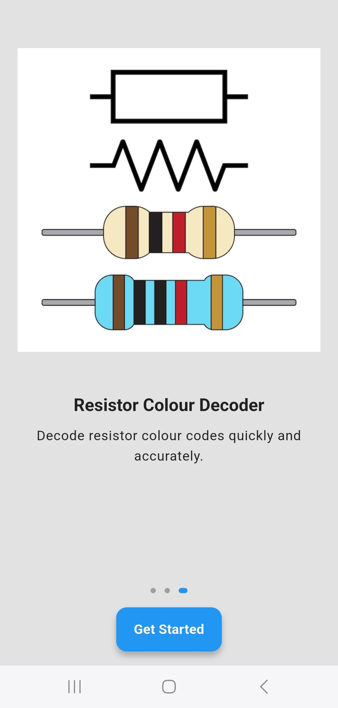
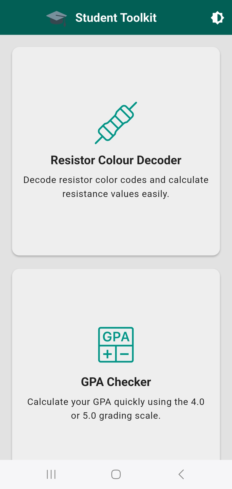
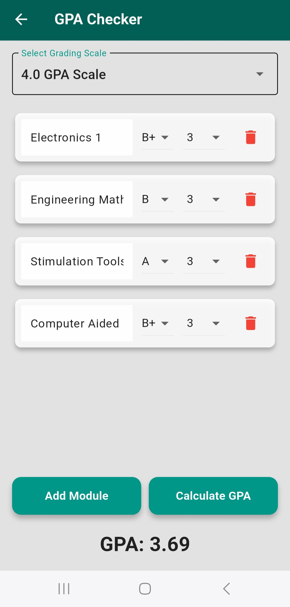
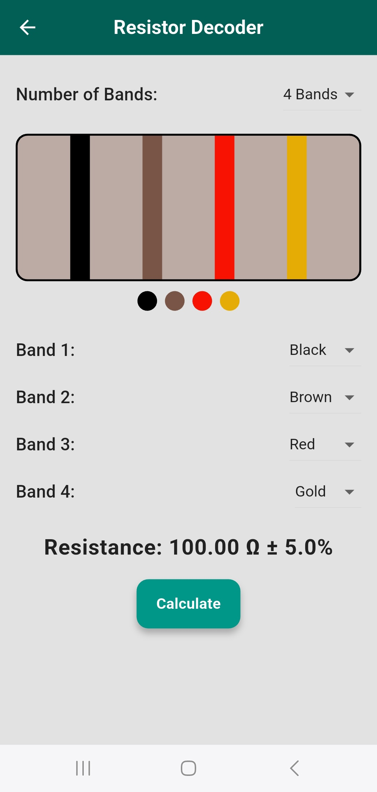

# Student Toolkit App


## 📱 Overview

Student Toolkit is a comprehensive mobile application designed for students, especially engineering students. This app serves as an all-in-one academic toolkit that helps students with various calculations and academic tools frequently used in engineering studies.

## ✨ Features

### 🎯 Key Features
- **GPA Calculator**: 
  - Calculates GPA based on the University of Sierra Leone grading scale
  - Supports multiple courses with different credit hours
  - Provides clear grade point assignments
- **Resistor Colour Code Calculator**:
  - Supports 3-band and 4-band resistors
  - Real-time resistance calculation
  - Comprehensive colour code reference
  - Easy-to-use interface with visual colour selection
  - Includes tolerance band calculation

- **User Interface**:
  - Dark/Light theme support
  - Intuitive navigation
  - Responsive design
  - Smooth animations
  - Onboarding tutorial for new users

### 🛠 Technical Features
- Firebase Analytics integration for usage tracking
- Responsive design that adapts to different screen sizes
- Offline functionality - no internet required for calculations
- Custom theme implementation with system theme detection

## 🚀 Technologies Used

- **Framework**: Flutter
- **Language**: Dart
- **Backend Services**: Firebase
- **State Management**: Provider
- **Analytics**: Firebase Analytics
- **Local Storage**: Shared Preferences
- **UI Components**: Material Design, Custom Widgets
- **Version Control**: Git

## 📸 App Screenshots

<div style="display: flex; flex-wrap: wrap; gap: 10px; justify-content: start;">
    
    
    
    
    
</div>

## 🎯 Project Context

This project was developed as my final Webstack Portfolio Project for the ALX Software Engineering Program (Cohort 22), specializing in Frontend Development. It showcases:

- Modern UI/UX design principles
- Clean architecture and code organization
- State management in Flutter
- Firebase integration
- Analytics implementation
- Cross-platform development capabilities

## ⚙️ Current Release

- Platform: Android Only
- Distribution: APK file (Play Store release planned for future)
- Version: 1.0.0
- Status: Beta Release

## 📥 Download

[](https://github.com/Emmie05/Student-Tookit-App/releases/download/v1.0.0/StudentToolkit.apk)

### Scan QR Code to Download
<div align="start">
    
    <p><em>Scan this QR code with your Android device to download the app</em></p>
</div>

### Installation Instructions
1. Download the APK file from the link above
2. On your Android device, allow installation from unknown sources:
   - Go to Settings > Security > Install unknown apps
   - Select your browser and enable "Allow from this source"
3. Open the downloaded APK file
4. Follow the installation prompts
5. Launch Student Toolkit

**Note**: This app is currently available for Android devices only.


## 🛠️ Installation

1. Download the APK file from the releases section
2. Enable "Install from Unknown Sources" in your Android settings
3. Install the APK
4. Grant required permissions when prompted

For developers:
```bash
git clone https://github.com/Emmie05/Student-Tookit-App.git
```

2. Install dependencies:
```bash
flutter pub get
```

3. Run the app:
```bash
flutter run
```

## 🔧 Configuration

To use Firebase services:
1. Create a Firebase project
2. Add your own `google-services.json` for Android
3. Add your own `GoogleService-Info.plist` for iOS
4. Update Firebase configuration in `lib/firebase_options.dart`

## 👤 Developer

- **Emmanuel Forster**
  - Role: Frontend Developer
  - Program: ALX Software Engineering, Cohort 22
  - LinkedIn: [Emmanuel Forster](https://www.linkedin.com/in/emmanuel-forster-3ab072296)
  - GitHub: [Emmie05](https://github.com/Emmie05)
  - Twitter: [@EmmForster](https://twitter.com/EmmForster)


## 🙏 Acknowledgments

- ALX Software Engineering Program
- All testers (Collegues at Fourah Bay College)

## 📊 Project Status

Current Version: 1.0.0
Status: Active Development

---
© 2025 Emmanuel Forster. All Rights Reserved.

